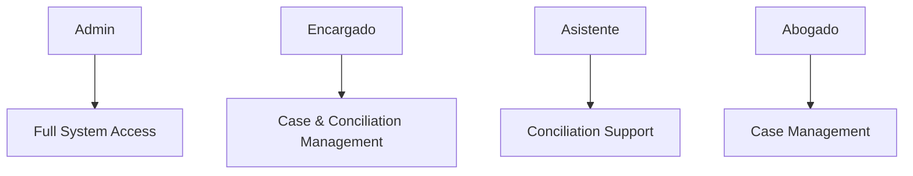

## Overview

Sistema de Abogados implements a role-based access control system with four distinct user types, each with specific capabilities and access levels. This structure ensures that users can only access the functionality relevant to their role within the legal practice.

## User Role Hierarchy



## Admin Role

<Card title="Administrator" icon="shield-halved" color="#dc2626">
  Full system access with complete control over users, roles, permissions, and all application features.
</Card>

### Capabilities

Administrators have unrestricted access to all system functionality:

- **User Management**: Create, edit, and delete users (except other admins)
- **Role Management**: Create, modify, and delete roles
- **Permission Management**: Create and assign permissions to roles and users
- **All Data Access**: Full access to cases, conciliations, clients, and documents
- **System Configuration**: Manage system-wide settings and configurations

### Admin-Exclusive Routes

The following routes are only accessible to users with the `admin` role:

```php routes/web.php
Route::middleware(['auth', 'role:admin'])->name('admin.')->prefix('admin')->group(function() {
    Route::get('/', [IndexController::class, 'index'])->name('index');
    
    // Role Management
    Route::resource('/roles', RoleController::class);
    Route::post('/roles/{role}/permissions', [RoleController::class, 'givePermission']);
    Route::delete('/roles/{role}/permissions/{permission}', [RoleController::class, 'revokePermission']);
    
    // Permission Management
    Route::resource('/permissions', PermissionController::class);
    Route::post('/permissions/{permission}/roles', [PermissionController::class, 'assignRole']);
    Route::delete('/permissions/{permission}/roles/{role}', [PermissionController::class, 'removeRole']);
    
    // User Management
    Route::resource('/users', UserController::class);
    Route::post('/users/{user}/roles', [UserController::class, 'assignRole']);
    Route::delete('/users/{user}/roles/{role}', [UserController::class, 'removeRole']);
    Route::post('/users/{user}/permissions', [UserController::class, 'givePermission']);
    Route::delete('/users/{user}/permissions/{permission}', [UserController::class, 'revokePermission']);
});
```

### Admin Seeder

The default admin user is created during database seeding:

```php database/seeders/AdminSeeder.php
public function run()
{
    User::create([
        'name' => 'admin',
        'email' => 'admin@pizarro.com',
        'email_verified_at' => now(),
        'password' => '$2y$10$92IXUNpkjO0rOQ5byMi.Ye4oKoEa3Ro9llC/.og/at2.uheWG/igi',
    ])->assignRole('writer', 'admin');
}
```

<Warning>
Admin users are protected from deletion. The system prevents deleting users with the admin role to maintain system integrity.
</Warning>

---

## Encargado Role

<Card title="Case Manager (Encargado)" icon="briefcase" color="#2563eb">
  Senior staff member with comprehensive access to both case management and conciliation processes.
</Card>

### Capabilities

Encargados serve as case managers with broad access:

- **Case Management**: Full CRUD access to legal cases (casos)
- **Conciliation Management**: Complete access to conciliation processes (conciliación)
- **Expediente Management**: Manage conciliation expedientes and documentation
- **Client Management**: Create and manage client records
- **Activity Scheduling**: Create and manage activities for both cases and conciliations
- **Document Management**: Upload and manage case and expediente documents

### Encargado Routes

Encargados have access to the following route groups:

<AccordionGroup>
  <Accordion title="Client Management">
    ```php routes/web.php
    Route::middleware(['auth', 'role:encargado|admin|asistente|abogado'])
        ->name('clientes.')
        ->prefix('clientes')
        ->group(function() {
            Route::resource('/', ClienteController::class);
            // Full client CRUD operations
        });
    ```
  </Accordion>
  
  <Accordion title="Conciliation Management">
    ```php routes/web.php
    Route::middleware(['auth', 'role:encargado|admin|asistente'])
        ->name('conciliacion.')
        ->prefix('conciliacion')
        ->group(function() {
            Route::resource('/submaterias', SubmateriaController::class);
            Route::resource('/invitado', InvitadoConciliacionController::class);
            Route::resource('/conciliador', ConciliadorController::class);
            Route::resource('/expediente', ExpedienteController::class);
        });
    ```
  </Accordion>
  
  <Accordion title="Case Management">
    ```php routes/web.php
    Route::middleware(['auth', 'role:encargado|admin|abogado'])
        ->name('caso.')
        ->prefix('caso')
        ->group(function() {
            Route::resource('/caso', CasosController::class);
            Route::resource('/tipoProceso', TipoProcesoController::class);
            Route::resource('/parteContraria', ParteContrariaController::class);
        });
    ```
  </Accordion>
  
  <Accordion title="Activity Management">
    ```php routes/web.php
    // General activities (all authenticated users)
    Route::middleware(['auth', 'verified'])
        ->name('agenda.')
        ->prefix('agenda')
        ->group(function() {
            Route::resource('/actividad', ActividadController::class);
        });
    
    // Conciliation activities
    Route::middleware(['auth', 'role:encargado|admin|asistente'])
        ->name('agenda.')
        ->prefix('agenda')
        ->group(function() {
            Route::resource('/actividadConciliacion', ActividadConciliacionController::class);
        });
    
    // Case activities
    Route::middleware(['auth', 'role:encargado|admin|abogado'])
        ->name('agenda.')
        ->prefix('agenda')
        ->group(function() {
            Route::resource('/actividadCaso', ActividadCasoController::class);
        });
    ```
  </Accordion>
</AccordionGroup>

---

## Asistente Role

<Card title="Assistant (Asistente)" icon="user-tie" color="#16a34a">
  Support staff focused on conciliation processes and administrative tasks.
</Card>

### Capabilities

Asistentes provide administrative support for conciliation:

- **Conciliation Support**: Full access to conciliation processes
- **Expediente Management**: Create and manage conciliation expedientes
- **Client Management**: View and manage client information
- **Document Management**: Handle expediente documentation
- **Conciliation Activities**: Schedule and manage conciliation-related activities
- **Submateria Management**: Manage conciliation subject matters
- **Invitado Management**: Manage invited parties to conciliation

### Asistente Routes

<AccordionGroup>
  <Accordion title="Conciliation Access">
    Asistentes share conciliation routes with Encargados and Admins:
    
    - Expediente management (`/conciliacion/expediente`)
    - Submateria management (`/conciliacion/submaterias`)
    - Invitado management (`/conciliacion/invitado`)
    - Conciliador management (`/conciliacion/conciliador`)
    - Expediente documents and file management
  </Accordion>
  
  <Accordion title="Client Access">
    Full client management alongside other roles:
    
    ```php
    Route::middleware(['auth', 'role:encargado|admin|asistente|abogado'])
        ->name('clientes.')
        ->prefix('clientes')
        ->group(function() {
            Route::get('/', [ClienteController::class, 'index']);
            Route::get('/{cliente}', [ClienteController::class, 'show']);
            // Full CRUD operations
        });
    ```
  </Accordion>
  
  <Accordion title="Activity Management">
    Access to general activities and conciliation-specific activities:
    
    - General activities (`/agenda/actividad`)
    - Conciliation activities (`/agenda/actividadConciliacion`)
  </Accordion>
</AccordionGroup>

<Note>
Asistentes do **not** have access to case (caso) management routes, which are reserved for Encargados, Admins, and Abogados.
</Note>

---

## Abogado Role

<Card title="Lawyer (Abogado)" icon="gavel" color="#9333ea">
  Licensed attorney with access to case management and client interaction.
</Card>

### Capabilities

Abogados focus on legal case management:

- **Case Management**: Full CRUD access to legal cases
- **Client Management**: View and manage client records
- **Process Types**: Manage tipos de proceso (process types)
- **Opposing Parties**: Manage partes contrarias (opposing parties)
- **Case Documents**: Upload and manage case documentation
- **Case Activities**: Schedule and track case-related activities
- **Calendar Access**: View and manage activity calendar

### Abogado Routes

<AccordionGroup>
  <Accordion title="Case Management">
    Full access to case management routes:
    
    ```php routes/web.php
    Route::middleware(['auth', 'role:encargado|admin|abogado'])
        ->name('caso.')
        ->prefix('caso')
        ->group(function() {
            Route::resource('/caso', CasosController::class);
            Route::post('/caso/{caso}/procesos', [CasosController::class, 'assignProceso']);
            Route::post('/caso/{caso}/p_contrarias', [CasosController::class, 'assignPContraria']);
            // Case document management routes
        });
    ```
  </Accordion>
  
  <Accordion title="Client Management">
    Shared client access with all other roles:
    
    - View client list
    - Create new clients
    - Edit client information
    - View client details
    - Search clients
  </Accordion>
  
  <Accordion title="Activity Management">
    Access to general activities and case-specific activities:
    
    ```php
    // Case activities
    Route::middleware(['auth', 'role:encargado|admin|abogado'])
        ->name('agenda.')
        ->prefix('agenda')
        ->group(function() {
            Route::resource('/actividadCaso', ActividadCasoController::class);
        });
    ```
  </Accordion>
</AccordionGroup>

<Note>
Abogados do **not** have access to conciliation (conciliación) routes, which are reserved for Encargados, Admins, and Asistentes.
</Note>

---

## Role Comparison Matrix

| Feature | Admin | Encargado | Asistente | Abogado |
|---------|-------|-----------|-----------|----------|
| User Management | ✓ | ✗ | ✗ | ✗ |
| Role Management | ✓ | ✗ | ✗ | ✗ |
| Permission Management | ✓ | ✗ | ✗ | ✗ |
| Case Management | ✓ | ✓ | ✗ | ✓ |
| Conciliation Management | ✓ | ✓ | ✓ | ✗ |
| Client Management | ✓ | ✓ | ✓ | ✓ |
| Expediente Management | ✓ | ✓ | ✓ | ✗ |
| Case Activities | ✓ | ✓ | ✗ | ✓ |
| Conciliation Activities | ✓ | ✓ | ✓ | ✗ |
| General Activities | ✓ | ✓ | ✓ | ✓ |
| Calendar Access | ✓ | ✓ | ✓ | ✓ |
| Profile Management | ✓ | ✓ | ✓ | ✓ |

## Common Routes (All Authenticated Users)

Some routes are available to all authenticated users regardless of role:

```php routes/web.php
// Dashboard
Route::middleware(['auth', 'verified'])->name('dashboard')->prefix('dashboard')->group(function() {
    Route::get('/', [indexController::class, 'dashboard']);
    Route::get('/', [indexController::class, 'dashCalendar']);
});

// Calendar
Route::middleware(['auth', 'verified'])->name('agenda.')->prefix('agenda')->group(function() {
    Route::get('/calendar', [CalendarController::class, 'index'])->name('calendar.index');
});

// Profile Management
Route::middleware('auth')->group(function () {
    Route::get('/profile', [ProfileController::class, 'edit'])->name('profile.edit');
    Route::patch('/profile', [ProfileController::class, 'update'])->name('profile.update');
    Route::delete('/profile', [ProfileController::class, 'destroy'])->name('profile.destroy');
});

// General Activities
Route::middleware(['auth', 'verified'])->name('agenda.')->prefix('agenda')->group(function() {
    Route::resource('/actividad', ActividadController::class);
});
```

## Assigning Roles

Only administrators can assign roles to users. See the [Roles and Permissions](/users/roles-permissions) guide for detailed instructions on role assignment.

<Steps>
  <Step title="Admin Access Required">
    Log in as a user with the `admin` role
  </Step>
  
  <Step title="Navigate to User Management">
    Go to `/admin/users` to view all users
  </Step>
  
  <Step title="Select User">
    Click on a user to view their role management page
  </Step>
  
  <Step title="Assign Role">
    Select the appropriate role and submit the assignment
  </Step>
</Steps>

## Best Practices

<CardGroup cols={2}>
  <Card title="Single Role Assignment" icon="user">
    Typically, assign one primary role per user based on their job function
  </Card>
  <Card title="Principle of Least Privilege" icon="lock">
    Grant the minimum role necessary for users to perform their duties
  </Card>
  <Card title="Regular Reviews" icon="rotate">
    Periodically review user roles to ensure they align with current responsibilities
  </Card>
  <Card title="Role Documentation" icon="book">
    Document role assignments and reasons for any exceptions or multiple roles
  </Card>
</CardGroup>

## See Also

<CardGroup cols={2}>
  <Card title="Roles and Permissions" icon="shield" href="/users/roles-permissions">
    Learn how to manage roles, permissions, and access control
  </Card>
  <Card title="Authentication" icon="key" href="/users/authentication">
    Understand authentication flows and session management
  </Card>
</CardGroup>